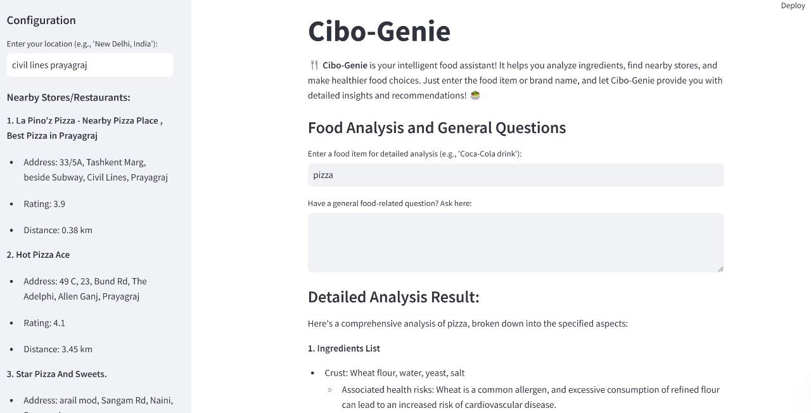
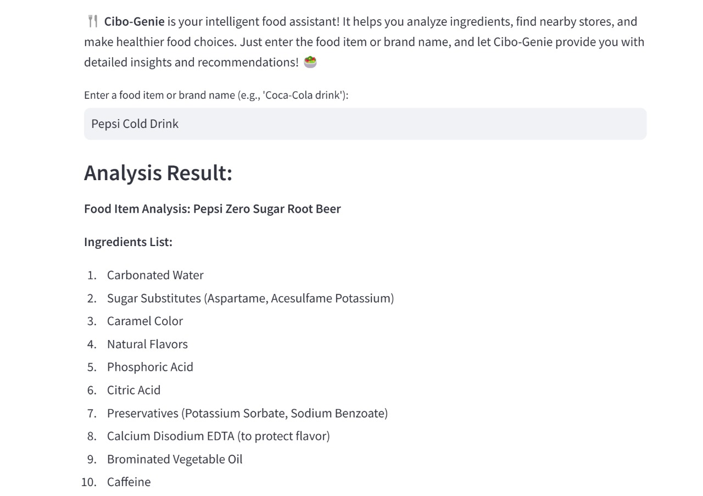
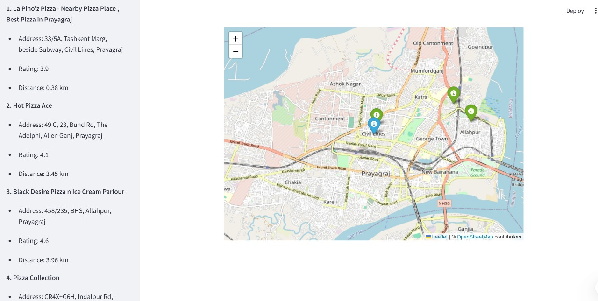

# CiboGenie

CiboGenie is an AI-powered application designed to revolutionize food analysis. Whether you're a food enthusiast, health-conscious individual, or a professional in the food industry, CiboGenie provides interactive, actionable insights into food items. Using cutting-edge AI, CiboGenie analyzes food ingredients, recommends healthier substitutes, and helps you make informed decisions about what you eat.

With integrations to **Wikipedia**, **Google Search**, **SERP API**, **Groq API**, and advanced AI models, **CiboGenie** offers detailed insights on:

- 🥗 **Food Ingredients**: In-depth analysis of food components.
- ⚖️ **Safe Consumption Guidelines**: Ensures safe and healthy food consumption.
- 🍎 **Healthier Alternatives**: Recommends healthier substitutes to improve your diet.
- 🔍 **Product Comparisons**: Compares the food you're consuming with similar products in the market.
- 🏪 **Nearby Shop Recommendations**: Finds local stores where you can purchase the food item.

---

## **Features**

- 🥗 **Food Analysis**: Provides a comprehensive breakdown of food ingredients, health considerations, and consumption guidelines.
- 🤖 **AI-Powered Recommendations**: Suggests healthier substitutes and analyzes food items based on nutrition and quality.
- 🏪 **Nearest Shops Finder**: Allows users to input their location and find the nearest shops that sell the given food item.
- 🌐 **Multi-Source Data Gathering**: Utilizes data from Wikipedia, Google, and other credible sources to provide well-rounded insights.
- 🔄 **Retrieval-Augmented Generation (RAG) Pipeline**: Combines information retrieval with generative AI for improved and more accurate responses by leveraging external data sources such as Google Search, Wikipedia, and PDFs.
- 📖 **PDF Parsing and Analysis**: Extracts and analyzes content from PDF documents using PyPDF2 for richer insights.
- 🔍 **Semantic Similarity Analysis**: Employs Sentence Transformers to compute embeddings and find semantically similar content.
- 🗄️ **Vector Storage Using FAISS**: Stores and retrieves document embeddings for efficient search within PDFs and other data sources.
- 🔧 **Customizable**: Designed to adapt to specific food items, ensuring tailored recommendations.
- 🌎 **Geolocation Services**: Integrates with the Google Maps API to find nearby shops based on user location.
- 🛠️ **Customizable Token Limit**: Allows users to adjust the maximum token limit for responses to optimize performance based on specific use cases.

---

## **Technologies Used**

### **Backend & AI Integration**
- **Python**: Core programming language for application logic.
- **Streamlit**: Interactive and user-friendly interface for the application.
- **TensorFlow**: Supports machine learning-based recommendations and food analysis.
- **Groq API**: Powers natural language processing for generating detailed insights.
- **RAG Pipeline**: Enhances response accuracy by combining retrieval with generative AI.

### **Data Retrieval and Analysis**
- **SERP API**: Fetches relevant data from Google Search for food analysis and nearby shop recommendations.
- **Wikipedia API**: Retrieves detailed summaries and credible information about food items.
- **PyPDF2**: Parses and extracts text from PDF documents to enhance analysis capabilities.
- **FAISS**: Efficient vector store for storing and retrieving document embeddings.
- **Sentence Transformers**: Computes embeddings to enable semantic similarity searches.

### **Geolocation and Mapping**
- **Google Maps API**: Finds nearby stores where the food item can be purchased.

### **Environment Management**
- **dotenv**: Manages environment variables such as API keys securely.

---

## **Installation**

### Prerequisites
Before running CiboGenie, ensure you have the following:
- Python 3.x
- An active API Key for accessing Google, Wikipedia, and other data sources

### Steps to Set Up

1. **Clone the repository:**
    ```bash
    git clone https://github.com/your-username/CiboGenie.git
    cd CiboGenie
    ```

2. **Create and activate a virtual environment:**
    ```bash
    python -m venv cibogenv
    source cibogenv/bin/activate   # On Windows, use cibogenv\Scripts\activate
    ```

3. **Install the required dependencies:**
    ```bash
    pip install -r requirements.txt
    ```

4. **Set up the environment variables for API keys:**
    - Create a `.env` file in the project root and add your keys:
      ```env
      GOOGLE_API_KEY=your_google_api_key
      GROQ_API_KEY=your_groq_api_key
      GOOGLE_MAPS_API_KEY=your_google_maps_api_key
      ```

5. **Run the application:**
    ```bash
    streamlit run app.py
    ```

6. **Open the local URL** (usually [http://localhost:8501](http://localhost:8501)) in your browser to start using CiboGenie.

---

## **Usage**

1. **Enter a Food Item:** Type a food item (e.g., "Coke") into the input field.
2. **Get Detailed Insights:** Receive a structured, actionable breakdown, including:
    - Ingredients List
    - Safe Consumption Guidelines
    - Healthier Substitutes
    - Comparison with Similar Products
    - Special Health Considerations
3. **Add Your Location:** Input your location (city or area) to find the nearest shops where you can purchase the food item.
4. **Explore Further:** Browse through recommendations for better alternatives and dietary tips.

---

## **Customizable Token Limit**
- The token limit for the RAG pipeline is set at **3000 tokens** by default. This value can be adjusted by the user to optimize performance based on their specific use case or application.
    - To adjust the token limit, you can modify the `max_tokens` parameter in the configuration file or directly in the pipeline settings in the application code.

---

## **Screenshots**

### Main Dashboard
**Pizza**



### Food Analysis Results
**Pepsi Cold Drink**



### Shop Locator
**Pizza**



---

## **Contributing**

We welcome contributions to make CiboGenie even better! Here’s how you can help:

1. Fork the repository
2. Create a feature branch
3. Commit your changes
4. Push to the branch
5. Submit a pull request

---

## **License**

This project is licensed under the **GNU General Public License** (GPL) **Version 3, 29 June 2007**. See the [LICENSE](LICENSE) file for details.

---

## **Contact**

For any inquiries or feedback, feel free to reach out:

- *Email*: ranjeetkulkarni2505@gmail.com
- *Email*: iit2023064@iiita.ac.in
- *GitHub*: [CiboGenie Repository](https://github.com/ranjeetkulkarni/CiboGenie)

---

Thank you for using CiboGenie! We hope it makes your food analysis journey both insightful and exciting.
